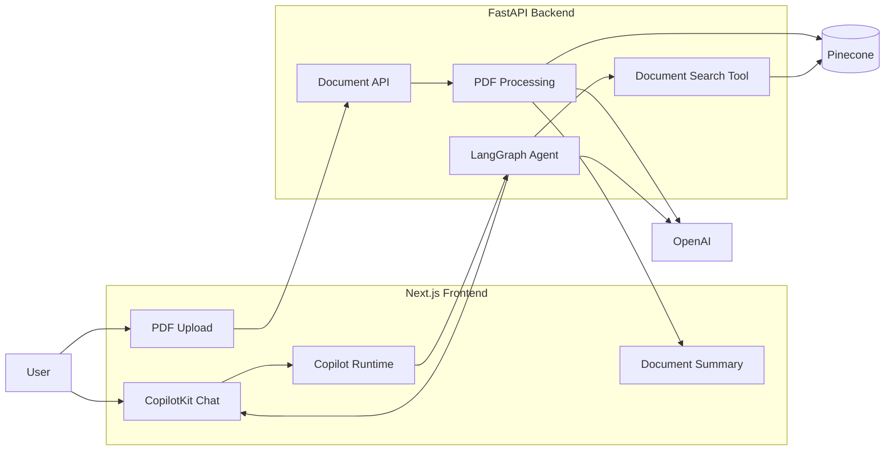
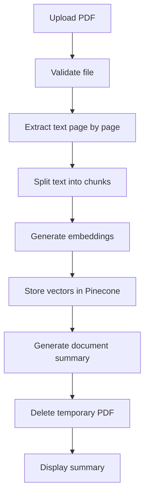
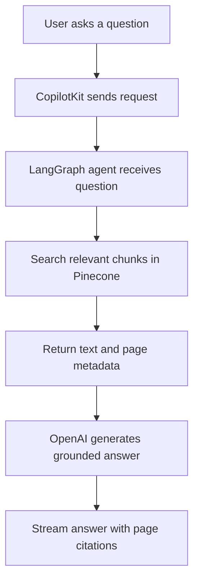

# PDF AI Assistant

A full-stack AI application that allows users to upload a PDF, generate a summary, and ask questions about its content.

The application uses Retrieval-Augmented Generation (RAG) to retrieve relevant sections from the PDF before generating answers. This helps ensure responses are grounded in the uploaded document and include page references.

## Architecture



## Application Workflow

### PDF processing



### Question answering



## How RAG Works

The application does not send the complete PDF to the language model for every question.

Instead, it:

1. Extracts the PDF text.
2. Splits the text into smaller chunks.
3. Converts each chunk into an embedding.
4. Stores the embeddings in Pinecone.
5. Searches for chunks related to the user's question.
6. Sends only the relevant chunks to the language model.
7. Generates an answer with page citations.

## Features

- Upload text-based PDF files
- Extract and split PDF content into chunks
- Generate and store embeddings in Pinecone
- Automatically summarize uploaded documents
- Ask questions through an AI chat interface
- Retrieve relevant document sections using semantic search
- Return answers with page citations
- Delete document vectors after removing a PDF
- Support switching from OpenAI to Ollama later

## Tech Stack

### Frontend

- Next.js App Router
- TypeScript
- React
- Tailwind CSS
- CopilotKit
- AG-UI Client

### Backend

- Python
- FastAPI
- LangChain
- LangGraph
- OpenAI
- Pinecone
- PyPDF
- AG-UI LangGraph

## Project Structure

```text
pdf-ai-assistant/
├── backend/
│   ├── app/
│   │   ├── agents/
│   │   ├── api/
│   │   ├── core/
│   │   ├── models/
│   │   ├── services/
│   │   └── main.py
│   ├── tests/
│   └── pyproject.toml
│
├── frontend/
│   ├── src/
│   │   ├── app/
│   │   ├── components/
│   │   └── lib/
│   └── package.json
│
└── README.md
```

## Getting Started

### Requirements

- Python 3.12+
- Node.js 20+
- `uv`
- `pnpm`
- OpenAI API key
- Pinecone API key

### Backend environment

Create `backend/.env`:

```env
OPENAI_API_KEY=your-openai-api-key

PINECONE_API_KEY=your-pinecone-api-key
PINECONE_INDEX_NAME=pdf-ai-assistant
PINECONE_CLOUD=aws
PINECONE_REGION=us-east-1

CHAT_MODEL=gpt-4.1-mini
EMBEDDING_MODEL=text-embedding-3-small

MAX_UPLOAD_SIZE_MB=20
FRONTEND_ORIGIN=http://localhost:3000
```

### Frontend environment

Create `frontend/.env.local`:

```env
BACKEND_URL=http://127.0.0.1:8000
NEXT_PUBLIC_BACKEND_URL=http://localhost:8000
```

### Start the backend

```bash
cd backend
uv sync
uv run uvicorn app.main:app --reload --port 8000
```

Backend API:

```text
http://localhost:8000
```

API documentation:

```text
http://localhost:8000/docs
```

### Start the frontend

```bash
cd frontend
pnpm install
pnpm dev
```

Frontend:

```text
http://localhost:3000
```

## Current Limitations

- Only text-based PDFs are supported
- Scanned PDFs require OCR
- The original PDF is not permanently stored
- Authentication is not implemented
- Only one active document is supported
- Document processing runs inside the upload request
- Pinecone vectors may remain after a browser refresh

## Future Improvements

- Ollama support
- OCR for scanned PDFs
- Multiple documents per conversation
- User authentication and document ownership
- Background PDF processing
- Conversation history
- Hybrid search and reranking
- Structured citation links
- Cost and token usage tracking

## License

This project is intended for learning and experimentation.
